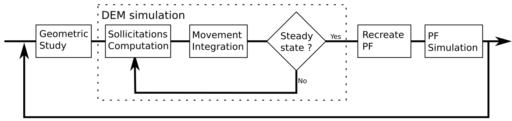

# PFDEM_ACS_MultiGrains

Phase-Field Discrete Element Modelisation with solute generation applied to multiple grains.

This work is presented in the following paper : 
Alexandre Sac-Morane, Manolis Veveakis, Hadrien Rattez. (2024). A Phase-Field Discrete Element Method to study chemo-mechanical coupling in granular materials. Computer Methods in Applied Mechanics and Engineering. https://doi.org/10.1016/j.cma.2024.116900

## Simulation presentation
The goal is to simulate the pressure solution phenomena (described by the following scheme) between multiple grains.

## Technical description
The PFDEM is a discussion between phase-field (PF) simulation and discrete element modelization (DEM). Even if those formulations are different, they can collaborate with data exchange.

The [phase-field theory](https://en.wikipedia.org/wiki/Phase-field_model) is based on the mesh of the sample and grains are represented by a phase variable (= 1 if the node is a grain, = 0 else). This formulation transmit to the DEM the shape of the grain. Hence, a grain detection algorithm is used to extract the shape from the phase field. In this case, no information about the solute is needed as it is assumed the solute is instantaneously evacuated.

The [discrete element model](https://en.wikipedia.org/wiki/Discrete_element_method) does not need mesh and grains are represented by a list of vertices (here polygonal grains are assumed). The role of the DEM is to compute the position of the grains. Then, an algorithm is used to convert the grain position in a new phase-field. The mechanical energy at the contact level is not considered as the acid is the motor term of the dissolution.

A back and forth is done between phase-field (PF) simulation and discrete element modelisation (DEM). Hence, once a steady-state is reached with the DEM, the phase-field theory is called. The shape of the grains will change and the steady state is not verified and must be computed by a new DEM step.
The following schemes illustrate the algorithm.

Phase-field approach is computed with [MOOSE](https://github.com/idaholab/moose) (the solver must be correctly installed) and DEM is computed with an own script based on python 3.9.6. The launch of this project is done by executing the python script <i>main.py</i> (multiple run can be asked with <i>multiple_main.py</i>). The user can change variables inside the python script <i>User.py</i>. A section in the following helps to understand the different inputs.

Saves are done before the phase-field simulation and at the end of the DEM. If crash (it seems to happend often during the phase-field simulation with MOOSE) occurs during the simulation, the function <i>main_after_crash.py</i> can be called to come back before the crash.

A [documentation](https://alexsacmorane.github.io/pfdem_acs_mg) for the python script is available.

### Phase-field
The goal of the phase-field step is to compute the shape of the grains as it evolves with the precipitation/dissolution.
An Allen-Cahn formulation is used coupled with a solute generation and diffusion. Hence, the conservation of the mass should be verified as precipitation/dissolution occurs.

### DEM
The goal of the DEM step is to compute a steady-state configuration. Grains are assumed as polygonal. The shape is computed from an interpolation of the phase variable. At the end of the step, interactions (grain-grain and grain-wall) are computed to highlight the evolution of the chain force and k0.

## What is next ?
Some next releases are presented here.

- add some quick tests to check the script
- update mesh with strain
- increase the user experience (homogenize names, correct english)
- correct the functions P_is_inside() because if the coordinate y = the coordinate of the vertex, the point is considered outside (even  if it is not the case)
- create AI or a guide to select algorithm parameters (as neighborhood update frequency, time step, stop criteria, etc...)

## Understand User.py

#### Geometry

- <i>N_grain</i> : the number of the grains
- <i>L_R</i> : is the list of the radius. It defines the particle size distribution of the grains with the variable <i>L_percentage_R</i>
- <i>L_percentage_R</i> : is the percentage of total number of grains with a linked radius. It defines the particle size distribution of the grains with the variable <i>L_R</i>

#### Sample

- <i>x_box_min</i> : the minimum on the x axis of the sample
- <i>x_box_max</i> : the maximum on the x axis of the sample
- <i>n_x</i> : the number of nodes in the x direction
- <i>y_box_min</i> : the minimum on the y axis of the sample
- <i>n_y</i> : the number of nodes in the y direction
- <i>grain_discretization_square</i> : is the discretization of the grains

#### Material

- <i>Mobility</i> : The mobility of the phase variables
- <i>kappa_eta</i> : the gradient coefficient for the phase variables
- <i>kappa_c</i> : the gradient coefficient for the solute
- <i>Y</i> : the Young modulus
- <i>nu</i> : the Poisson ratio
- <i>rho</i> : the density of the grain. A surface density <i>rho_surf</i> is determined as 4/3*<i>rho</i>*<i>R_mean</i>
- <i>mu_friction_gg</i> : the friction coefficient for grain-grain contact
- <i>mu_friction_gw</i> : the friction coefficient for grain-wall contact
- <i>coeff_restitution</i> : the restitution coefficient for contact

#### Algorithm

- <i>np_proc</i> : number of processor used for the simulation
- <i>n_t_PFDEM</i> : the total number of PFDEM iteration. A PFDEM iteration is composed by one DEM and one phase-field simulations.
- <i>n_t_PF</i> : approximatively the time step of the phase-field simulation. It defines with <i>dt_PF</i> the total duration of the phase-field simulation
- <i>dt_PF</i> : the time step used for the phase-field simulation. This value is defined with different values. The selection of the value depend on the total absolute energy energy. Criterias to switch level are defined with <i>Ed_level</i>
- <i>factor_etai</i> : is a factor related to the minimal distance between grains with same eta
- <i>dt_DEM</i> : the time step for the DEM simulation
- <i>i_DEM_stop</i> : the maximum iterations done during a DEM simulation
- <i>i_update_neighborhoods</i>: the frequency of neighborhood update
- <i>factor_neighborhood</i> : defines the size of the neighborhood
- <i>Ecin_ratio</i> : defines a stop criteria for the DEM simulation. The steady-state is assumed when the mean displacement during one DEM step is lower than the ratio of the mean radius
- <i>n_window_stop</i> : defines a steps window to detect the steady state
- <i>dy_box_max_stop</i> : in the window defined by <i>n_window_stop</i>, the steady-state is detected if the difference between the maximum and the minimum upper wall position is lower than <i>dy_box_max_stop</i>
- <i>sphericity_margin</i> : is a margin (because of numerical estimation) for grain sphericity compute
- <i>n_spatial_inscribing</i> : is a precision (because of numerical estimation) for grain sphericity compute
- <i>c_min</i> and <i>c_max</i> : are minimum and maximum values for plotting solute concentration
- <i>L_flag_plot</i> : is the list of plots to do. The different options are available.
                      - <i>Config</i> : Grain et solute configuration
                      - <i>DEM_tracker</i> : Tracker during the DEM step
                      - <i>DEM_txt</i> : A .txt file with DEM information at the end of the DEM step
                      - <i>Diff_Solute</i> : Diffusion of the solute (not available for the moment!)
                      - <i>dt</i> : Evolution of the time step used during phase-field iterations. This one depend on the energy introduced in the sample
                      - <i>Ed</i> : Plot the initial energy map
                      - <i>Etai_distribution</i> : Plot the initial distribution of the etai
                      - <i>Eta_c</i> : Plot the evolution of the sum of the etai and the solute
                      - <i>Init_Current_Shape</i> : Plot the shape comparaison (current vs initial)
                      - <i>Kc</i> : Diffusion map
                      - <i>Movie</i> : Movie of the different configurations
                      - <i>Mesh</i> : Plot the mesh on the initial configuration
                      - <i>Porosity</i> : Plot the evolution of the sample porosity (Sg/Sbox)
                      - <i>Sphericity</i> : Evolution of the 2D sphericity of the grains
                      - <i>sum_Ed</i> : Distribution of the energy in the sample
                      - <i>YBoxMax</i> : Evolution of the upper wall position
- <i>struct_element</i> : element used in dilation step to compute node available map

#### Sollicitations

- <i>chi</i> : chemical energy coefficient in the phase-field formulation
- <i>gravity</i> : gravity applied to grains
- <i>Vertical_Confinement_Force</i> : confinement force applied on the upper wall

The coefficient <i>alpha</i> applied to the mechanical energy term is computed from a calibration simulation with the function <i>Add_variables_needed</i> 

#### Initial configuration

- <i>n_generation</i> : number of grain generation
- <i>N_test_max</i> : the maximum number of try to generate a grain without overlap with grains already created
- <i>factor_ymax_box</i> : define the upper wall position for the grain generation
- <i>i_update_neighborhoods_gen</i>: frequency of neighborhood update during one generation step.
- <i>i_update_neighborhoods_com</i>: frequency of neighborhood update during multi generation step.
- <i>factor_neighborhood_IC</i> : defines the size of the neighborhood
- <i>i_DEM_stop_IC</i> : the maximum DEM iterations
- <i>dt_DEM_IC</i> : the DEM time step
- <i>Ecin_ratio_IC</i> : defines a stop criteria for the DEM simulation. The steady-state is assumed when the mean displacement during one DEM step is lower than the ratio of the mean radius
